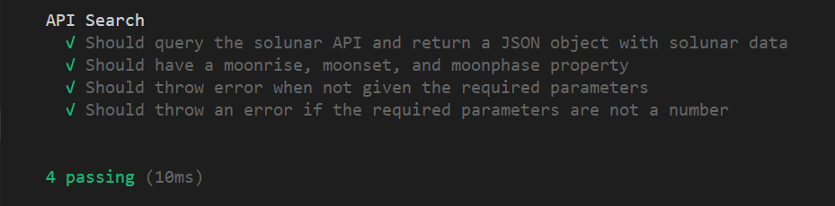
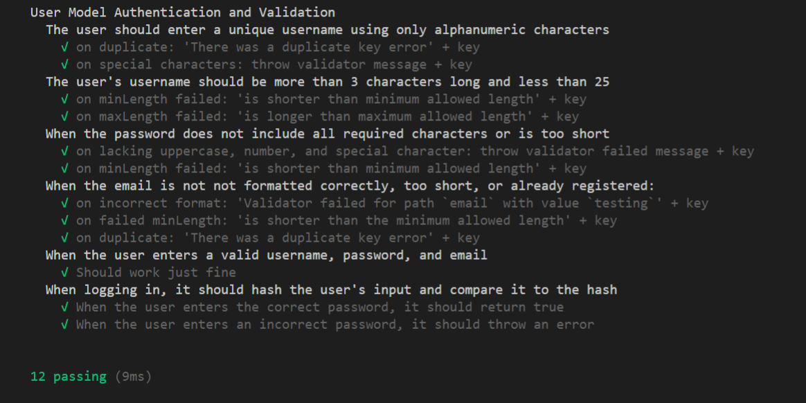

# Moon Child

> Lovely moon child / Dreaming in the shadow / Of the willow
> /- King Crimson

>"You're beloved of the moon, Ninefingers"
> /- Crummock-i-Phail, Last Argument of Kings, Joe Abercrombie*

Moon Child is a simple journalling app for potential lycanthropes and lunatics (hah, get it?) who like to keep tabs on the moon phases. The app serves two simple purposes: informing visitors of the current moon phase, and allowing registered users to create a journal categorized by the moon phase. 

A relatively simple (and private) journalling app, Moon Child allows users to create posts, query their past posts by category or moon phase, and keep tabs on the upcoming moon phases. 

# Motivation

Moon Child was developed with witches, farmers, hunters, and astrophiles in mind. Other apps provide useful information about the current moon phase, but Moon Child allows users to develop a more intimiate relationship to our planet's beautiful satellite through journalling.

(See: Testing)

# Features

+ User Authentication
+ Moon Phase Indicator
+ Journal

# Tech/framework used

__Built With:__
+ Mongo DB
+ Express
+ React
+ Node JS

# Installation

1. Clone this repository
2. Run npm i 
3. cd client
4. Run npm i
5. cd ..
6. yarn dev

# Tests

Moon Child's other motivation was for me, as a developer, to begin developing and expanding my ability to use the testing framework and library Mocha and Chai. In my previous project, Merry Meet I found myself stumbling over many errors in the end phases of development when they became time-costly to debug and explore. (To be fair, I was building it in a limited time frame). 

To test the various features of Moon Child, type npm test in the root or client folder.

API Test: 

User Model Test:

# Status

Project is still in its nascent phases. Back end logic and routing is still in development. Components will come soon after.

# Credit

Hats off to the lunatic @dugb who created the elegant [SolunarAPI](https://solunar.org/), which made this app possible.

